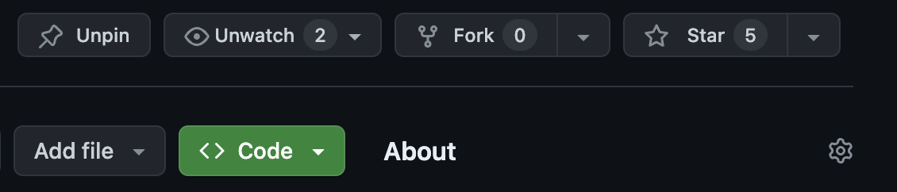
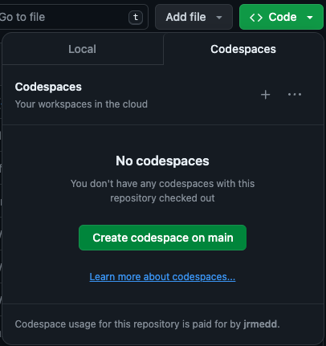
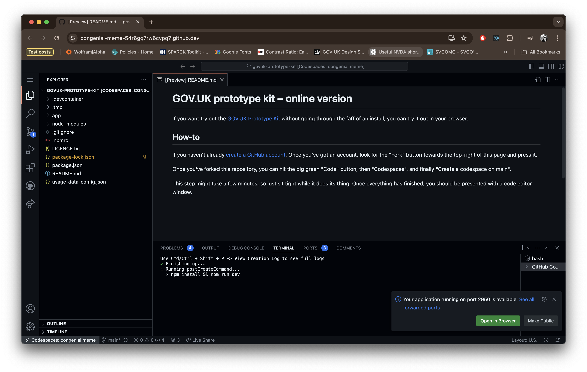
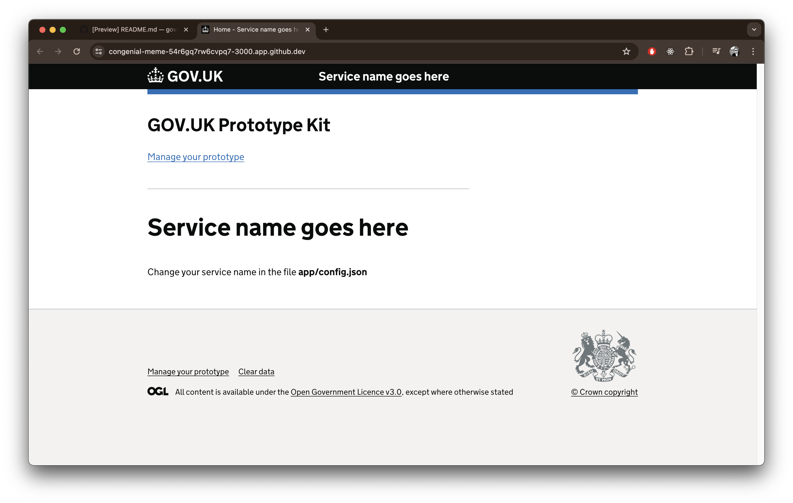
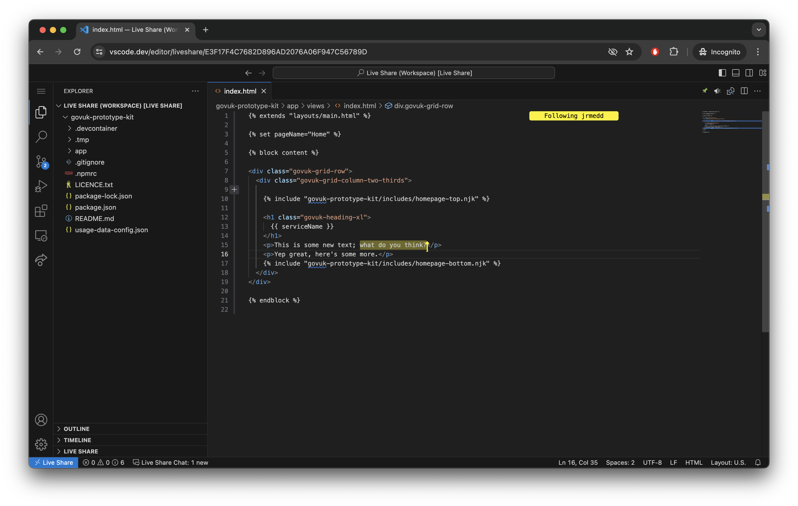

# GOV.UK prototype kit – online version 

If you want try out the [GOV.UK Prototype Kit](https://prototype-kit.service.gov.uk/docs/) without going through the faff of an install, you can try it out in your browser.

## How to get started

If you haven't already [create a GitHub account](https://github.com/signup). Once you've got an account, look for the "Fork" button towards the top-right of this page and press it.

Once you've forked this repository, you can hit the big green "Code" button, then "Codespaces", and finally "Create a codespace on main".

This step might take a few minutes, so just sit tight while it does its thing. Once everything has finished, you should be presented with a code editor window.

## What next?

After another short pause, you should see a notification in the bottom-right saying that your application is running, which you can launch in your browser.

From there you'll see the homepage of the prototype kit, where you can create new pages from templates and get familiar with the kit.

## Collaborating

You can instantly start collaborating by hitting the "Live Share" button in the footer and sending a link to someone (you'll have to approve them when they join).

